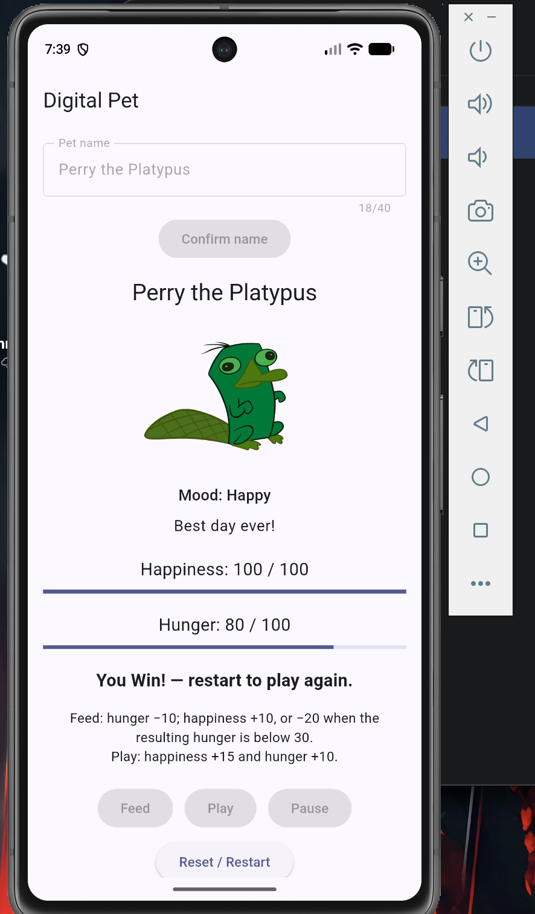
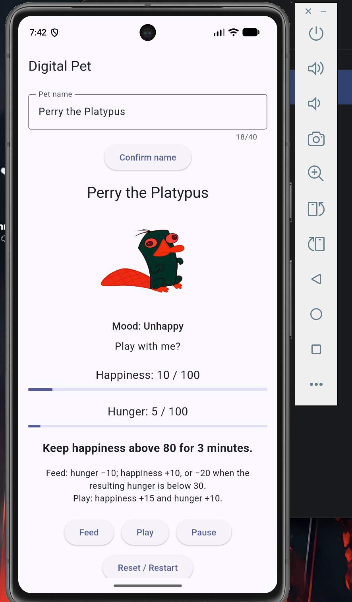
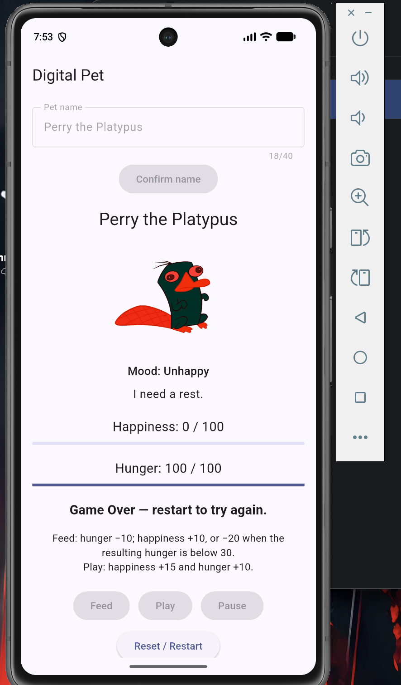

## Undergraduate Features

| Feature | Learning outcome | Evidence |
| --- | --- | --- |
| Pause/resume | State controls timers and available actions. Pause cancels timers; resume begins a fresh win streak. | Paused controls checked on emulator. |
| Visual polish | Mood size and message transitions derive from pet state. Reduced motion sets animation durations to zero. | Mood changes checked; reduced-motion device test pending. |

## Commands

- Setup: `flutter pub get`
- Run: `flutter run -d emulator-5554`
- Analyze: `flutter analyze`
- Test: `flutter test`
- Release: `flutter build apk --release`

## Care Rules

Feed lowers hunger by 10. Happiness increases by 10 unless resulting hunger is below 30, when happiness decreases by 20. Play increases happiness by 15 and hunger by 10. All meters are clamped to 0–100.

## Recorded Checks

The analyzer and Feed → Play → Reset test passed. We checked care actions, reset, unhappy mood, and pause controls on the emulator. The three-minute win appeared, and hunger stopped afterward. Loss was tested with a temporary one-second hunger timer. We restored hunger timing to 30 seconds and confirmed the three-minute win duration.

## Screenshots

## Contributions and Review

Jalen Artis shared the initial care code and reviewed PR #1. Abubeker Mohammed added pet personality and completed the care integration. The care-completion PR was merged without a second cross-team review.

Pet personality PR: https://github.com/abubekerm1/digital_pet/pull/1

## Unverified Items

Full boundary-matrix testing, reduced-motion device testing, landscape testing, and release installation are not yet recorded. Image reuse permission is unverified, and the colored image makes the neutral yellow tint appear green.